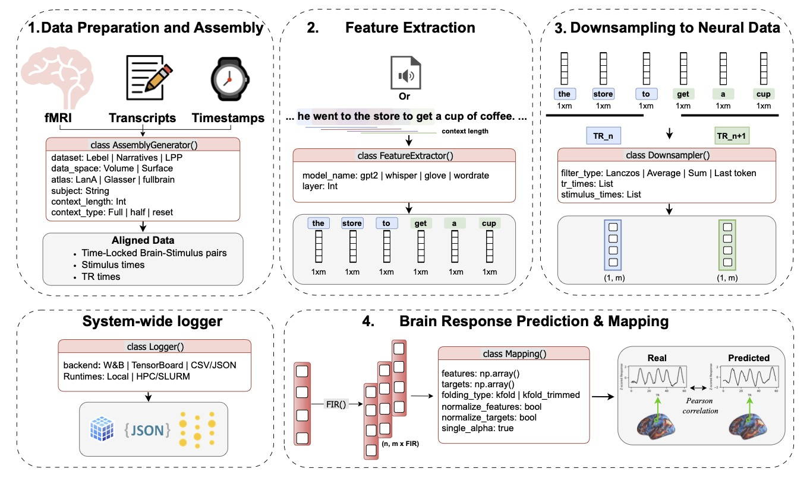

# LITcoder

This repository accompanies the paper "LITcoder: A General-Purpose Library for Building and Comparing Encoding Models" ([arXiv:2509.09152](https://www.arxiv.org/abs/2509.09152)). It provides a modular pipeline to align continuous stimuli with fMRI data, build encoding models, and evaluate them.




---

## 1) Prerequisites

- Python 3.10+

Environment setup:
```bash
git clone git@github.com:GT-LIT-Lab/litcoder_core.git
cd litcoder_core
conda create -n litcoder -y python=3.12.8
conda activate litcoder
conda install pip
pip install -e .
```

> **Important Notes:**
> - The package is installed in development mode (`-e` flag) for easy development and updates
> - PyPI package coming soon! Until then, use the development installation above
---


## 2) Quick setup from a prepackaged assembly (LeBel)
This shows how easy it is to train a model using LITcoder. The assembly, was created using the `AssemblyGenerator` class, which is part of the `encoding.assembly.assembly_generator` module.
Use the packaged LeBel assembly and train a wordrate-only model end-to-end. This assembly will help you get started with the library and understand the core components, and to better understand the tutorials.

First, download the Lebel pre-packaged assembly

```bash
gdown 1q-XLPjvhd8doGFhYBmeOkcenS9Y59x64
```

Then run the following:

```python
from encoding.assembly.assembly_loader import load_assembly
from encoding.features.factory import FeatureExtractorFactory
from encoding.downsample.downsampling import Downsampler
from encoding.models.nested_cv import NestedCVModel
from encoding.trainer import AbstractTrainer

# 1) Load prepackaged assembly
assembly_path = "assembly_lebel_uts03.pkl"
assembly = load_assembly(assembly_path)

# 2) Configure components (wordrate-only)
extractor = FeatureExtractorFactory.create_extractor(
    modality="wordrate",
    model_name="wordrate",
    config={},
    cache_dir="cache",
)

downsampler = Downsampler()
model = NestedCVModel(model_name="ridge_regression")

# FIR, downsampling, and trimming match our LeBel defaults
fir_delays = [1, 2, 3, 4]
trimming_config = {
    "train_features_start": 10, "train_features_end": -5,
    "train_targets_start": 0,  "train_targets_end": None,
    "test_features_start": 50,  "test_features_end": -5,
    "test_targets_start": 40,   "test_targets_end": None,
}

downsample_config = {}

# 3) Train
trainer = AbstractTrainer(
    assembly=assembly,
    feature_extractors=[extractor],
    downsampler=downsampler,
    model=model,
    fir_delays=fir_delays,
    trimming_config=trimming_config,
    use_train_test_split=True,
    logger_backend="wandb",
    wandb_project_name="lebel-wordrate",
    dataset_type="lebel",
    results_dir="results",
    downsample_config=downsample_config,
)

metrics = trainer.train()
print({
    "median_correlation": metrics.get("median_score", float("nan")),
    "n_significant": metrics.get("n_significant"),
})
```

Or run the ready-made script:

```bash
python train_simple.py
```

To download the assembly, use the following google drive link: [assembly_lebel_uts03.pkl](https://drive.google.com/file/d/1q-XLPjvhd8doGFhYBmeOkcenS9Y59x64/view?usp=sharing)

We recommend using this first for testing the installation. More details on how to create your own assembly will be added soon.
We will also be moving to a more scalable hosting solution for the assemblies in the very near future.

### 2.1) Tutorials for other modalities

- [Language Models](https://litcoder-brain.github.io/language-models.html)
- [Embeddings](https://litcoder-brain.github.io/embeddings.html)
- [Speech](https://litcoder-brain.github.io/speech.html)

Tutorials from documentation:
- [Language Models](https://gt-lit-lab.github.io/litcoder_core/tutorial_language_models.html)
- [Embeddings](https://gt-lit-lab.github.io/litcoder_core/tutorial_embeddings.html)
- [Speech](https://gt-lit-lab.github.io/litcoder_core/tutorial_speech.html)

## 3) Quick tutorial:

This library uses the same core modules across datasets, here's an example for Narratives:
- Create an assembly with `dataset_type="narratives"`, providing `data_dir`, `subject`, `tr`, `lookback`, `context_type`, and `use_volume`.
- Build `LanguageModelFeatureExtractor`, extract all layers per story (with caching via `ActivationCache`), and select `layer_idx`.
- Downsample to TRs with `Downsampler.downsample(...)` using `--downsample_method` and Lanczos parameters if applicable.
- Apply FIR delays with `FIR.make_delayed` using `--ndelays`.
- Concatenate the delayed features and brain data for the story order used in the script (currently `['21styear']`), then trim `[14:-9]` before modeling.
- Fit nested CV ridge via `fit_nested_cv(features=X, targets=Y, ...)` with your chosen folding and ridge parameters.


Minimal code sketch:

```python
from encoding.assembly.assembly_generator import AssemblyGenerator
from encoding.features import LanguageModelFeatureExtractor, FIR
from encoding.downsample.downsampling import Downsampler
from encoding.models.nested_cv import fit_nested_cv
from encoding.utils import ActivationCache
import numpy as np

# 1) Assembly
assembly = AssemblyGenerator.generate_assembly(
    dataset_type="narratives",
    data_dir="data/narratives/neural_data",
    subject="sub-256",
    tr=1.5,
    lookback=256,
    context_type="fullcontext",
    use_volume=False,
)

# 2) Models
extractor = LanguageModelFeatureExtractor({
    "model_name": "gpt2-small",
    "layer_idx": 9,
    "last_token": True,
})
cache = ActivationCache(cache_dir="cache_narratives")
ds = Downsampler()

downsampled_X, brain_data = {}, {}
for story in assembly.stories:
    idx = assembly.stories.index(story)
    texts = assembly.get_stimuli()[idx]

    cache_key = cache._get_cache_key(
        story=story,
        lookback=256,
        model_name="gpt2-small",
        context_type="fullcontext",
        last_token=False,
        dataset_type="narratives",
        raw=True,
    )
    lazy_cache = cache.load_multi_layer_activations(cache_key)
    if lazy_cache is not None:
        features = lazy_cache.get_layer(9)
    else:
        all_layers = extractor.extract_all_layers(texts)
        cache.save_multi_layer_activations(cache_key, all_layers, metadata={})
        features = all_layers[9]

    split_indices = assembly.get_split_indices()[idx]
    data_times = assembly.get_data_times()[idx]
    tr_times = assembly.get_tr_times()[idx]

    downsampled_X[story] = ds.downsample(
        data=features,
        data_times=data_times,
        tr_times=tr_times,
        method="lanczos",
        split_indices=None,
        window=3,
        cutoff_mult=1.0,
    )
    brain_data[story] = assembly.get_brain_data()[idx]

# FIR delays
ndelays = 8
delays = range(1, ndelays + 1)
delayed_features = {s: FIR.make_delayed(downsampled_X[s], delays) for s in assembly.stories}

story_order = ["21styear"]
X = np.concatenate([delayed_features[s] for s in story_order], axis=0)
Y = np.concatenate([brain_data[s] for s in story_order], axis=0)

# Trimming
X = X[14:-9]
Y = Y[14:-9]

# 4) Model
metrics, weights, best_alphas = fit_nested_cv(
    features=X,
    targets=Y,
    folding_type="kfold_trimmed"
    n_outer_folds=5,
    n_inner_folds=5,
    chunk_length=20,
    singcutoff=1e-10,
    use_gpu=False,
    single_alpha=True,
    normalpha=True,
    use_corr=True,
    normalize_features=False,
    normalize_targets=False,
)
```
> **Note:** In order to run the code above, you need to have the data downloaded and preprocessed. See the Litcoder_brain for more details(coming soon(09/29/2025)).


## 4) Tutorials
We will be adding tutorials on the following websites:

- [LITcoder_core](https://litcoder-brain.github.io/tutorials.html)


## Project Status and Contributions

This repository is under active development. We will continue to add many features and improvements. The main components will not change, and any further updates should not affect your current experiments. Bug reports, feature requests, and pull requests are highly appreciated. Please open an issue or submit a PR; for larger changes, consider starting a discussion first.

---

## 🚧 Roadmap

### 📋 TODO

- [ ] **Add comprehensive test suite** - Unit tests, integration tests, and validation tests
- [ ] **Migrate to PyPI** - Package distribution and easy installation via `pip`
- [ ] **Google colab quickstart tutorial** - Coming soon(09/29/2025)

### 🔮 Future Enhancements

- [ ] **Documentation improvements** - API docs, tutorials, and examples
- [ ] **Additional model support** - More language models and architectures
- [ ] **Interactive demos** - Jupyter notebooks and web interfaces

---

*Contributions welcome! Please open an issue or submit a pull request.*


## Citation

If you use **LITcoder** in your research, please cite:
```bibtex
@misc{binhuraib2025litcodergeneralpurposelibrarybuilding,
      title={LITcoder: A General-Purpose Library for Building and Comparing Encoding Models}, 
      author={Taha Binhuraib and Ruimin Gao and Anna A. Ivanova},
      year={2025},
      eprint={2509.09152},
      archivePrefix={arXiv},
      primaryClass={cs.CL},
      url={https://arxiv.org/abs/2509.09152}, 
}
```